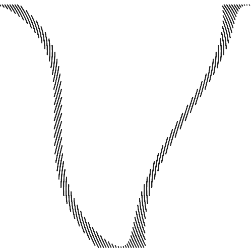
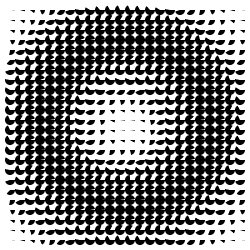

Shapes
############

Shape
=====

.. autoclass:: glc.shapes.Shape
    :members:

Container
=========

.. autoclass:: glc.shapes.Container
    :members:

Arc Segment
===========

.. literalinclude:: _static/arc_segment_example.py
    :language: python

.. autoclass:: glc.shapes.ArcSegment
    :members:

Arrow
=====

.. literalinclude:: _static/arrow_example.py
    :language: python

.. autoclass:: glc.shapes.Arrow
    :members:

Bézier Curve
============

.. literalinclude:: _static/bezier_curve_example.py
    :language: python

.. autoclass:: glc.shapes.BezierCurve
    :members:

Bézier Segment
==============

.. literalinclude:: _static/bezier_segment_example.py
    :language: python

.. autoclass:: glc.shapes.BezierSegment
    :members:

Circle
======

.. literalinclude:: _static/circle_example.py
    :language: python

.. autoclass:: glc.shapes.Circle
    :members:

Curve
=====

TODO: add example here

.. autoclass:: glc.shapes.Curve
    :members:

Curved Path
===========

TODO: add example here

.. autoclass:: glc.shapes.CurvePath
    :members:

Curved Segment
==============

TODO: add example here

.. autoclass:: glc.shapes.CurveSegment
    :members:

Gear
====

TODO: add example here

.. autoclass:: glc.shapes.Gear
    :members:

Gradient Pie
============

TODO: add example here

.. autoclass:: glc.shapes.GradientPie
    :members:

Grid
====

TODO: add example here

.. autoclass:: glc.shapes.Grid
    :members:

Heart
=====

TODO: add example here

.. autoclass:: glc.shapes.Heart
    :members:

Image
=====

TODO: add example here

.. autoclass:: glc.shapes.Image
    :members:

Isometric Box
=============

TODO: add example here

.. autoclass:: glc.shapes.IsoBox
    :members:

Isometric Tube
==============

TODO: add example here

.. autoclass:: glc.shapes.IsoTube
    :members:

Line
====

TODO: add example here

.. autoclass:: glc.shapes.Line
    :members:

Oval
====

TODO: add example here

.. autoclass:: glc.shapes.Oval
    :members:

Path
====

TODO: add example here

.. autoclass:: glc.shapes.Path
    :members:

Polygon
=======

TODO: add example here

.. autoclass:: glc.shapes.Poly
    :members:

Ray
===

TODO: add example here

.. autoclass:: glc.shapes.Ray
    :members:

Ray Segment
===========

TODO: add example here

.. autoclass:: glc.shapes.RaySegment
    :members:

Rectangle
=========

TODO: add example here

.. autoclass:: glc.shapes.Rect
    :members:

Round Rectangle
===============

TODO: add example here

.. autoclass:: glc.shapes.RoundRect
    :members:

Segment
=======

TODO: add example here

.. autoclass:: glc.shapes.Segment
    :members:

Spiral
======

TODO: add example here

.. autoclass:: glc.shapes.Spiral
    :members:

Splat
=====

TODO: add example here

.. autoclass:: glc.shapes.Splat
    :members:

Star
====

TODO: add example here

.. autoclass:: glc.shapes.Star
    :members:

Text
====

TODO: add example here

.. autoclass:: glc.shapes.Text
    :members:
